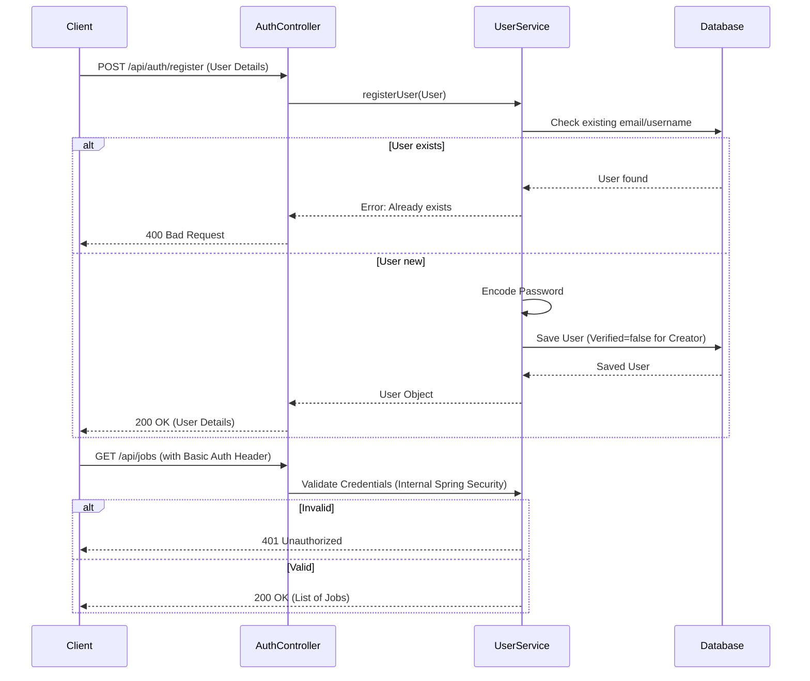

# FindJobApp

FindJobApp is a robust Spring Boot backend application designed to facilitate job searching and recruitment. It connects Job Creators, Job Seekers, and System Administrators through a secure and efficient platform.

## Features

### 1. Job Creator
- **Authentication**: Secure login and registration.
- **Job Management**: Create, read, update, and delete (CRUD) job postings.
- **Application Management**: View applications, and assign statuses (Schedule Interview, Confirm, Deny).
- **Notifications**: Automated emails sent to applicants upon acceptance.
- **Profile Management**: Update personal details.
- **Verification**: Requires Sysadmin verification before posting jobs.

### 2. Job Seeker
- **Authentication**: Secure login and registration.
- **Job Discovery**: Browse all available job postings.
- **Applications**: Apply for jobs and track application status.
- **Profile Management**: Update personal details.

### 3. Sysadmin
- **Authentication**: Secure login.
- **User Management**: View all profiles and verify Job Creators.
- **Data Management**: Delete users and jobs.
- **Analytics**: Dashboard overview of system stats (User counts, Job counts).

## Technology Stack
- **Backend Framework**: Spring Boot 3.5.7
- **Language**: Java 21
- **Database**: PostgreSQL
- **Security**: Spring Security (Basic Auth)
- **Persistence**: Spring Data JPA
- **Email**: Spring Boot Starter Mail

## Setup & Configuration

### Prerequisites
- JDK 21
- Maven
- PostgreSQL

### Database Setup
1. Create a PostgreSQL database named `find_job_app`.
2. Update `src/main/resources/application.properties` with your credentials:
   ```properties
   spring.datasource.url=jdbc:postgresql://localhost:5432/find_job_app
   spring.datasource.username=postgres
   spring.datasource.password=Alecb200@
   ```

### Email Configuration
To enable email sending, update the mail properties in `application.properties`:
```properties
spring.mail.host=smtp.gmail.com
spring.mail.port=587
spring.mail.username=your-email@gmail.com
spring.mail.password=your-app-password
```

### Running the Application
```bash
mvn spring-boot:run
```

## Authentication & Security
The application uses **Basic Authentication** for simplicity and ease of testing with Postman.
- **Stateless/Stateful**: It leverages standard Spring Security session management but can be used statelessly with Basic Auth headers for API testing.
- **Roles**: 
  - `JOB_CREATOR`
  - `JOB_SEEKER`
  - `SYSADMIN`

### Authentication Sequence Diagram



## Testing
Please refer to `Postman_Testing_Guide.md` for detailed instructions on how to import collections and test each endpoint.
